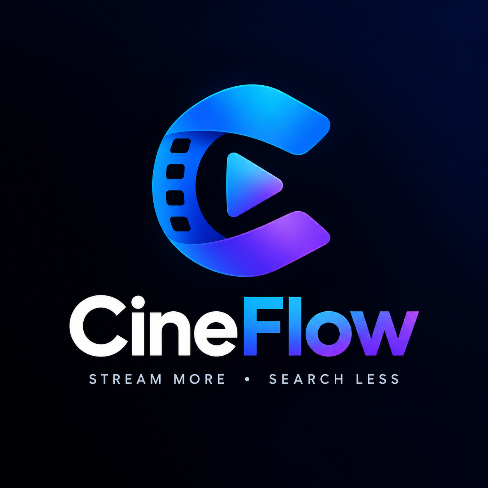

# Cineflow

<p align="center">
  
</p>

<p align="center">
  <strong>A clean Malayalam movie catalog addon for Stremio and Nuvio.</strong><br>
  Powered by TMDB metadata and designed for simple browsing without adding Cineflow catalogs to global search.
</p>

<p align="center">
  <a href="https://cineflow-8w0j.onrender.com/manifest.json">Install Cineflow</a>
  ·
  <a href="https://github.com/datainterpretor/Cineflow">GitHub</a>
</p>

---

## What is Cineflow?

Cineflow is a community Stremio-protocol addon focused on **Malayalam-language movies**.

It provides organized movie catalogs using TMDB's movie discovery data and converts TMDB movie IDs to IMDb IDs so compatible metadata providers such as Cinemeta can supply movie details.

Cineflow is designed to work with both **Stremio** and **Nuvio**.

### Main goals

- Keep Malayalam movie discovery organized.
- Keep Cineflow out of global text search.
- Separate released movies from future/unreleased movies.
- Provide useful genre-based catalogs.
- Remain lightweight and easy to self-host.

---

## Catalogs

Cineflow currently provides the following catalog groups:

| Catalog | Purpose |
|---|---|
| **Cineflow New Releases** | Recently released Malayalam movies. Only movies with a release date on or before today are allowed. |
| **Cineflow OTT Released** | Malayalam movies marked by TMDB as released through supported release types/regions. Unreleased movies are excluded. |
| **Cineflow future releases-Movies** | The dedicated catalog for upcoming/unreleased Malayalam movies. |
| **Cineflow Action** | Released Malayalam movies in the Action genre. |
| **Cineflow Adventure** | Released Malayalam movies in the Adventure genre. |
| **Cineflow Comedy** | Released Malayalam movies in the Comedy genre. |
| **Cineflow Crime** | Released Malayalam movies in the Crime genre. |
| **Cineflow Documentary** | Released Malayalam documentaries. |
| **Cineflow Drama** | Released Malayalam dramas. |
| **Cineflow Family** | Released Malayalam family movies. |
| **Cineflow Fantasy** | Released Malayalam fantasy movies. |
| **Cineflow History** | Released Malayalam historical movies. |
| **Cineflow Horror** | Released Malayalam horror movies. |
| **Cineflow Music** | Released Malayalam music-related movies. |
| **Cineflow Mystery** | Released Malayalam mystery movies. |
| **Cineflow Romance** | Released Malayalam romance movies. |
| **Cineflow Science Fiction** | Released Malayalam science-fiction movies. |
| **Cineflow Thriller** | Released Malayalam thrillers. |
| **Cineflow Direct Streams** | Optional direct-stream entry when a URL is configured in `urls.json`. |

### Release-date protection

Cineflow applies a second, local release-date check after receiving results from TMDB.

This is intentional:

- **Future/unreleased movies** are allowed only in `Cineflow future releases-Movies`.
- **New Releases, OTT, and Genre catalogs** reject movies whose primary release date is after today.
- Movies without a primary release date are also excluded from the released catalogs.
- The future catalog accepts only movies whose primary release date is **after today**.

This prevents an upcoming movie from accidentally appearing in a normal released-movie row because of incomplete or inconsistent TMDB data.

---

## Search behavior

Cineflow intentionally **does not advertise search support** in its catalog manifest.

The catalogs use:

```js
extra: [{ name: "skip" }]
```

rather than declaring a `search` extra.

### Why?

Some Stremio-compatible clients query every addon that declares search support when performing a global search. Cineflow is intended to provide browsing catalogs, not to inject its catalog rows into global search results.

Therefore:

- ✅ Cineflow catalogs remain available for browsing.
- ✅ Cineflow can appear in Discover/Home catalog areas.
- ❌ Cineflow does not declare global text-search participation.
- ❌ Cineflow should not create unrelated catalog rows during a global search.

---

# Installation

## Manifest URL

Use the following Cineflow manifest URL:

```text
https://cineflow-8w0j.onrender.com/manifest.json
```

You can also open the Cineflow website:

```text
https://cineflow-8w0j.onrender.com/
```

The website provides installation shortcuts and basic information about the addon.

---

# Install Cineflow in Nuvio

Nuvio supports the Stremio addon protocol, so Cineflow can be installed using its manifest URL.

### Android / Android TV

1. Open **Nuvio**.
2. Open **Settings**.
3. Go to **Content & Discovery → Addons** on supported mobile layouts.
4. On Android TV, open the **Addons** section from the sidebar.
5. Select **Add Addon** / **Install from URL**.
6. Paste:

   ```text
   https://cineflow-8w0j.onrender.com/manifest.json
   ```

7. Select **Install Addon**.
8. Return to your Nuvio home/discover screen.
9. Cineflow's catalogs should become available after Nuvio refreshes the addon list.

Nuvio's current addon documentation describes the same manifest-URL installation flow.

### Nuvio Companion

If you use **Nuvio Companion**, use its manifest-URL installation function and enter the same URL:

```text
https://cineflow-8w0j.onrender.com/manifest.json
```

Nuvio Companion currently provides an **Install by manifest URL** workflow for Nuvio/Stremio targets.

### Important: Nuvio search behavior

Cineflow is intentionally not a search addon. Its purpose is to provide organized catalogs.

If you search for a movie globally in Nuvio, Cineflow should not advertise itself as a search provider because its manifest does not declare the `search` capability.

---

# Install Cineflow in Stremio

Stremio supports manual installation using an addon manifest URL. Its current documentation also describes installing an addon through the addon manager or by manually using a manifest URL.

## Method 1 — Using the Cineflow website

1. Open:

   ```text
   https://cineflow-8w0j.onrender.com/
   ```

2. Select the **Install on Stremio** button.
3. Stremio should open or prompt you to install the addon.
4. Confirm the installation.

Stremio's addon protocol supports `stremio://` installation links that open/focus the Stremio client.

## Method 2 — Install using the manifest URL

Use:

```text
https://cineflow-8w0j.onrender.com/manifest.json
```

Depending on your Stremio client/version, you can paste the manifest URL into the addon installation/manager interface or open the addon website and use its installation button. Stremio documents manual manifest installation as a supported method.

## Method 3 — Stremio Web

1. Open Stremio Web.
2. Sign in to your Stremio account.
3. Open the **Addons** section.
4. Use the addon installation flow.
5. If a direct installation button is not available, use the Cineflow manifest URL:

   ```text
   https://cineflow-8w0j.onrender.com/manifest.json
   ```

When signed into a Stremio account, addon installations can be associated with that account and made available across supported devices using the same account.

---

# Updating Cineflow

Cineflow is a hosted addon. You do **not** need to install an APK or separate application for the addon itself.

When the hosted addon is updated, the manifest version is increased and your Stremio/Nuvio client can refresh the addon information.

If an old installation continues showing stale catalogs:

1. Remove Cineflow from your addon list.
2. Reinstall it using the current manifest URL.
3. Restart/refresh the client if necessary.

---

# Technical overview

Cineflow is built on the **Stremio Addon SDK** and Node.js.

### Stack

- Node.js
- `stremio-addon-sdk`
- Axios
- TMDB API
- Cinemeta-compatible IMDb IDs
- Express
- Render-compatible HTTP server

### Resources

The addon exposes:

```text
catalog
meta
stream
```

and supports:

```text
movie
```

### Data flow

```text
TMDB
  │
  ├── Malayalam movie discovery
  │
  ├── Release-date filtering
  │
  └── Genre / OTT filtering
  │
  ▼
Cineflow addon server
  │
  ├── TMDB ID → IMDb ID
  ├── Catalog response
  └── Metadata / stream handling
  │
  ▼
Stremio / Nuvio
```

---

# Self-hosting

You can run Cineflow on your own server.

## Requirements

- Node.js
- npm
- A TMDB API key
- A public HTTPS endpoint if you want to use the addon remotely

## 1. Clone the repository

```bash
git clone https://github.com/datainterpretor/Cineflow.git
cd Cineflow
```

## 2. Install dependencies

```bash
npm install
```

## 3. Configure the TMDB API key

Set the `TMDB_KEY` environment variable.

### Linux/macOS

```bash
export TMDB_KEY="YOUR_TMDB_API_KEY"
```

### Windows PowerShell

```powershell
$env:TMDB_KEY="YOUR_TMDB_API_KEY"
```

Do **not** put your real TMDB API key directly into `addon.js` or commit it to GitHub.

## 4. Start the server

```bash
npm start
```

The default local port is:

```text
7000
```

The manifest will be available at:

```text
http://127.0.0.1:7000/manifest.json
```

For another device on your network to access a local development server, use the computer's LAN address instead of `127.0.0.1`, and make sure the firewall permits the connection.

---

# Render deployment

Cineflow can be deployed as a Node.js web service on Render.

### Build command

```text
npm install
```

### Start command

```text
npm start
```

### Environment variable

Add:

```text
TMDB_KEY = your_tmdb_api_key
```

Do not commit the API key to GitHub.

After deployment, test:

```text
https://YOUR-RENDER-DOMAIN/manifest.json
```

A valid manifest response confirms that the addon server is reachable.

---

# Project structure

```text
Cineflow/
├── addon.js             # Stremio addon logic and TMDB catalogs
├── server.js            # Express + Stremio addon server
├── index.html           # Cineflow landing page
├── cineflow.png         # Cineflow logo
├── urls.json            # Optional direct-stream URL configuration
├── package.json         # Node.js project configuration
├── package-lock.json    # Locked dependency versions
├── LICENSE              # Project license
└── README.md            # Project documentation
```

---

# Configuration notes

## `urls.json`

The direct-stream catalog is enabled only when `urls.json` contains a non-empty URL in the expected format.

If no URL is configured, Cineflow simply does not expose the Direct Streams catalog.

---

# Troubleshooting

## Cineflow does not appear after installation

Check the manifest directly in a browser:

```text
https://cineflow-8w0j.onrender.com/manifest.json
```

If the manifest cannot be reached, the hosting service needs attention.

If the manifest opens correctly:

1. Remove the existing Cineflow addon.
2. Reinstall it.
3. Restart or refresh Nuvio/Stremio.
4. Check the Addons/Discover area again.

## Future movies appear in normal catalogs

The current implementation applies an explicit local release-date filter after TMDB results are received.

If this happens, check the movie's `primary_release_date` in TMDB and inspect the addon logs.

## Cineflow appears in global search

Cineflow's catalogs intentionally do not declare the `search` extra.

If a client still displays Cineflow-related rows during a search, verify that the installed manifest is the current one and that an older Cineflow/MalluFlix installation has not also been installed.

## Movies have posters but incomplete information

Cineflow returns IMDb IDs and basic catalog information. Rich movie metadata can be supplied by compatible metadata addons such as Cinemeta or other metadata providers configured in your client.

---

# Legal / content disclaimer

Cineflow is an addon software project. It does not itself host or distribute copyrighted movie files.

TMDB is used as a metadata/discovery source. The availability and legality of any external streams or sources are determined by the services providing them and by the laws applicable to the user.

Users are responsible for ensuring that their use of Stremio, Nuvio, Cineflow, external addons, and external sources complies with applicable laws and service terms.

---

# Credits

- **TMDB** — movie metadata and discovery data
- **Stremio Addon SDK** — addon protocol/server framework
- **Original MalluFlix project** — source/project inspiration and original implementation
- **Cineflow** — modified and maintained in this repository

This project is not affiliated with or endorsed by TMDB, Stremio, or Nuvio unless explicitly stated by those organizations.

---

# License

See [`LICENSE`](LICENSE) for the repository's license terms.

---

## Current version

**Cineflow v1.1.0**

Key changes in this version:

- Strictly prevents unreleased movies from New Releases, OTT, and Genre catalogs.
- Keeps upcoming movies exclusively in **Cineflow future releases-Movies**.
- Keeps Cineflow out of declared global search participation.
- Uses `TMDB_KEY` from the environment instead of storing the API key in source code.
